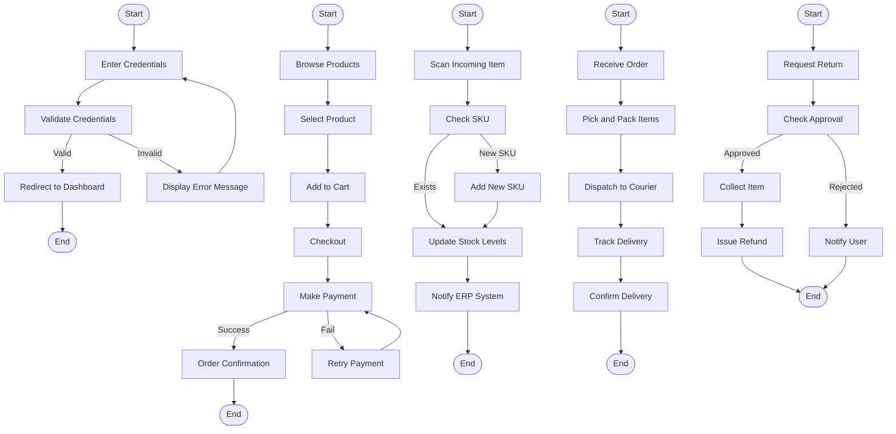

```mermaid
%% 1. User Login and Authentication
flowchart TD
    Start1([Start]) --> EnterCreds[Enter Credentials]
    EnterCreds --> Validate[Validate Credentials]
    Validate -->|Valid| Dashboard[Redirect to Dashboard]
    Validate -->|Invalid| ErrorMsg[Display Error Message]
    ErrorMsg --> EnterCreds
    Dashboard --> End1([End])

%% 2. Placing an Order (Procurement Workflow)
    Start2([Start]) --> Browse[Browse Products]
    Browse --> Select[Select Product]
    Select --> AddCart[Add to Cart]
    AddCart --> Checkout[Checkout]
    Checkout --> Payment[Make Payment]
    Payment -->|Success| Confirm[Order Confirmation]
    Payment -->|Fail| Retry[Retry Payment]
    Retry --> Payment
    Confirm --> End2([End])

%% 3. Inventory Update (Warehouse System)
    Start3([Start]) --> ScanItem[Scan Incoming Item]
    ScanItem --> CheckSKU[Check SKU]
    CheckSKU -->|Exists| UpdateStock[Update Stock Levels]
    CheckSKU -->|New SKU| AddNewSKU[Add New SKU]
    AddNewSKU --> UpdateStock
    UpdateStock --> NotifySys[Notify ERP System]
    NotifySys --> End3([End])

%% 4. Order Fulfillment and Delivery
    Start4([Start]) --> ReceiveOrder[Receive Order]
    ReceiveOrder --> PickPack[Pick and Pack Items]
    PickPack --> Dispatch[Dispatch to Courier]
    Dispatch --> Track[Track Delivery]
    Track --> Delivered[Confirm Delivery]
    Delivered --> End4([End])

%% 5. Return and Refund Workflow
    Start5([Start]) --> RequestReturn[Request Return]
    RequestReturn --> ApproveReturn[Check Approval]
    ApproveReturn -->|Approved| CollectItem[Collect Item]
    ApproveReturn -->|Rejected| NotifyUser[Notify User]
    CollectItem --> Refund[Issue Refund]
    Refund --> End5([End])
    NotifyUser --> End5
```
