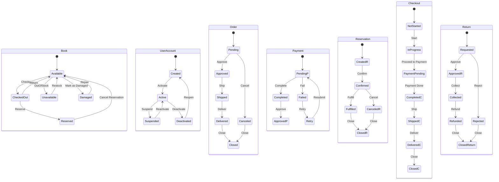

```mermaid
stateDiagram-v2
    %% 1. Book
    state Book {
        [*] --> Available
        Available --> CheckedOut: Checkout
        CheckedOut --> Reserved: Reserve
        Reserved --> Available: Cancel Reservation
        CheckedOut --> Available: Return
        Available --> Unavailable: OutOfStock
        Unavailable --> Available: Restock
        Available --> Damaged: Mark as Damaged
        Damaged --> Available: Repair
    }

    %% 2. User Account
    state UserAccount {
        [*] --> Created
        Created --> Active: Activate
        Active --> Suspended: Suspend
        Suspended --> Active: Reactivate
        Active --> Deactivated: Deactivate
        Deactivated --> Created: Reopen
    }

    %% 3. Order
    state Order {
        [*] --> Pending
        Pending --> Approved: Approve
        Pending --> Canceled: Cancel
        Approved --> Shipped: Ship
        Shipped --> Delivered: Deliver
        Delivered --> Closed: Close
        Canceled --> Closed: Close
    }

    %% 4. Payment
    state Payment {
        [*] --> PendingP
        PendingP --> Completed: Complete
        PendingP --> Failed: Fail
        Completed --> ApprovedP: Approve
        Failed --> Retry: Retry
        Retry --> PendingP: Resubmit
    }

    %% 5. Reservation
    state Reservation {
        [*] --> CreatedR
        CreatedR --> Confirmed: Confirm
        Confirmed --> CanceledR: Cancel
        Confirmed --> Fulfilled: Fulfill
        Fulfilled --> ClosedR: Close
        CanceledR --> ClosedR: Close
    }

    %% 6. Checkout
    state Checkout {
        [*] --> NotStarted
        NotStarted --> InProgress: Start
        InProgress --> PaymentPending: Proceed to Payment
        PaymentPending --> CompletedC: Payment Done
        CompletedC --> ShippedC: Ship
        ShippedC --> DeliveredC: Deliver
        DeliveredC --> ClosedC: Close
    }

    %% 7. Return
    state Return {
        [*] --> Requested
        Requested --> ApprovedR: Approve
        ApprovedR --> Collected: Collect
        Collected --> Refunded: Refund
        Refunded --> ClosedReturn: Close
        Requested --> Rejected: Reject
        Rejected --> ClosedReturn: Close
    }
```
